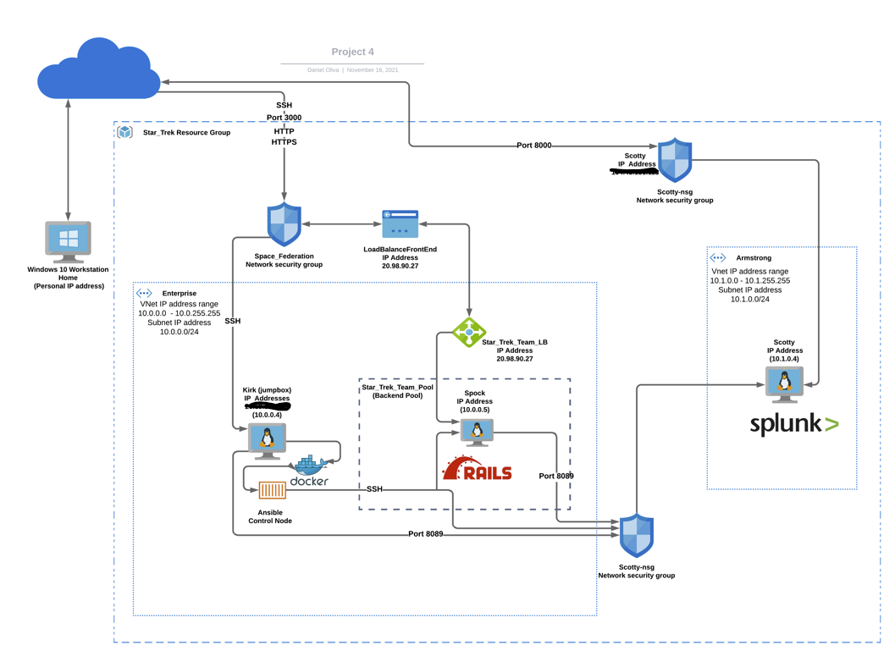

# Splunk Security Enterprise Deployment

The files in this repository were used to configure the network depicted below.

 

## Azure **https://azure.microsoft.com/en-us/**
### VM Specification
 - Linux (ubuntu 20.04) Operating System
 - 20_04-lts-gen2
 - Standard B1ms
 - 1 vCPU
 - 2 GiB RAM
 
These downloads have been tested and used to generate a live Splunk Enterprise deployment on Azure. They can be used to either recreate the deployment pictured above.
**Splunk**
https://www.splunk.com/

- https://www.splunk.com/en_us/download/universal-forwarder/thank-you-universalforwarder.html
- https://www.splunk.com/en_us/download/splunk-enterprise.html

This document contains the following details:
- Description of the Topology
- Access Policies
- Splunk Enterprise Configuration

### Description of the Topology

The main purpose of this network is to have a secure environment and monitor a Ruby On Rails instance application.

**Containerization was used to create a control node. This serves the purposed of security, elasticity, and scalability.**

**Load balancing ensures that the application will be highly redundant and available, in addition to restricting access to the network.**

**Load balancers protect the availability of the server. It reduce the attack vector on the back-end of the network.**

**Integrating a Splunk Enterprise instance allows users to easily monitor the VM's for changes to the configuration files, system logs, performance, and much more.**

The configuration details of each machine may be found below.
| Name   | Function   | IP Address | Operating System |
|--------|------------|------------|------------------|
| Kirk   | Jump-box   | 10.0.0.4   | Linux            |
| Spock  | Web Server | 10.0.0.5   | Linux            |
| Scotty | Splunk     | 10.1.0.4   | Linux            |

### Access Policies

The machines on the internal network are not exposed to the public Internet. 

Only the Jump-box machine can accept connections from the Internet. Access to this machine is only allowed from the following IP address: My personal IP address
-  Whitelisted (Personal IP address)

Machines within the network can only be accessed by the Jump-box through the control nose and a shell.

- I have allowed Kirk  (Jump-box) access to the Back-end Server Pool and Splunk Enterprise.

A summary of the access policies in place can be found in the table below.

| Name   | Publicly Accessible | Allowed IP Addresses |
|--------|---------------------|----------------------|
| Kirk   | Yes                 | Personal IP          |
| Spock  | No                  | 10.0.0.0-254         |
| Scotty | No                  | 10.1.0.0-254         |

### Splunk Enterprise Installation
**Download**
`wget -O splunk-8.2.3-cd0848707637-linux-2.6-amd64.deb 'https://download.splunk.com/products/splunk/releases/8.2.3/linux/splunk-8.2.3-cd0848707637-linux-2.6-amd64.deb'`
**Extract**
`dpkg -i splunk-8.2.3-cd0848707637-linux-2.6-amd64.deb`

Run `cd /opt/splunk/bin`
Run `./splunk start --accept-licences`
Run `./splunk add forward-server IP Address:9997`
Run `./splunk set deploy-poll IP Address:8089`
Than run `./splunk restart`
**Configuration**
Run `vi ../etc/splunk-launch.conf`
- Edit file to bind IP Address.
Run `cp /opt/splunk/etc/system/default/web.conf /opt/splunk/etc/system/local`
- Copy web.conf file. 
Run `vi /opt/splunk/etc/system/local/web.conf`
- Than edit file, uncomment mgmtHostPort=121.0.0.1:8089
- Edit to IP Address, should be the same at the BINDIP.
In azure, make inbound security rule allow port 8000.

The playbook implements the following tasks:
- Use apt module "essentially is apt get command in Linux operating systems" to Install docker.io container service and update_cache:
- Use apt module to Install pip3 and force_apt_get:
- Use pip module to Install Docker python module
- Use sysctl module to Use more memory
- Use docker_container module to download and launch a docker elk container,  image: sebp/elk:761, and restart_policy: always
- Use systemd module to Enable service docker on boot

The following screenshots displays the result of running `docker ps` and `systemctl` after successfully configuring the ELK instance.

[docker ps](Images/docker_ps_output_Project_1.png)
[systemctl](Images/systemctl_status_Project_1.png)

### Target Machines & Beats

I installed the following Beats on these machines:
- Filebeat
- Metricbeat

This ELK server is configured to monitor the following machines:
- 10.0.0.4
- 10.0.0.5
- 10.0.0.6
- 10.0.0.7

The `ansible.cfg` file must be edited to allow remote_user to access jumpbox and web servers.

These Beats allow collection of the following information from each machine:

- `Filebeat` collects log data of Syslogs, Sudo commands, SSH logins, New user and groups. Filebeat is very useful if you wanted to track SSH logins, successful and unsuccessful attempts.
- `Metricbeat` collects CPU and Memory Usage, Load, and Network Traffic metrics. Metricbeat is very useful if you wanted to monitor general functionality and performance of a specific machine. 

### Using the Playbook

In order to use the playbook, you will need to have an Ansible control node already configured. Assuming you have such a control node provisioned: 

SSH into the control node and follow the steps below:
- Copy the `filebeat and metricbeat configuration` files to  `/etc/ansible/filebeat.config.yml and /etc/ansible/metricbeat.config.yml`.
- Update the hosts file to include the private IP addresses for [webserver] and [jumpbox].
- Run the playbook, navigate to /etc/filebeat/filebeat.yml and /etc/metricbeat/metricbeat.yml on hosts and jumpbox to check the installation worked as expected.
- Ansible commands to be familiar with include `ansible [Hosts_Name] -m ping` and`ansible-playbook`.
- The **install-elk.yml**, **install-filebeat.yml**, **install-filebeat-jumpbox.yml**, **install-metricbeat.yml**, **install-metricbeat-jumpbox.yml** are in my ansible playbooks. They are located in the `/etc/ansible` directory.
- The hosts file needs to be updated if you intent run the playbook on a specific machine. In the hosts file you can indicate the [Hosts_Name] and below you list the Hosts private IP addresses.
- Navigate to the ELK Server URL `104.43.131.113:5601` to check that it is running, and monitoring the Virtual Network.

